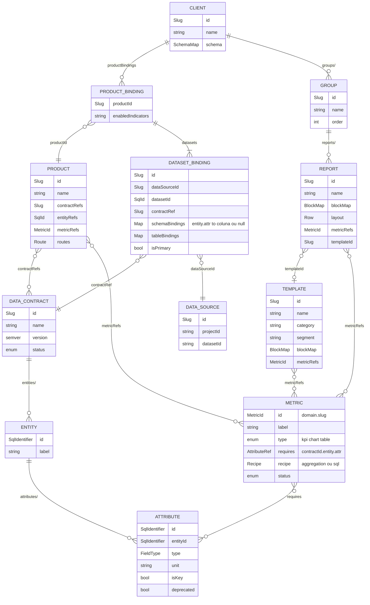
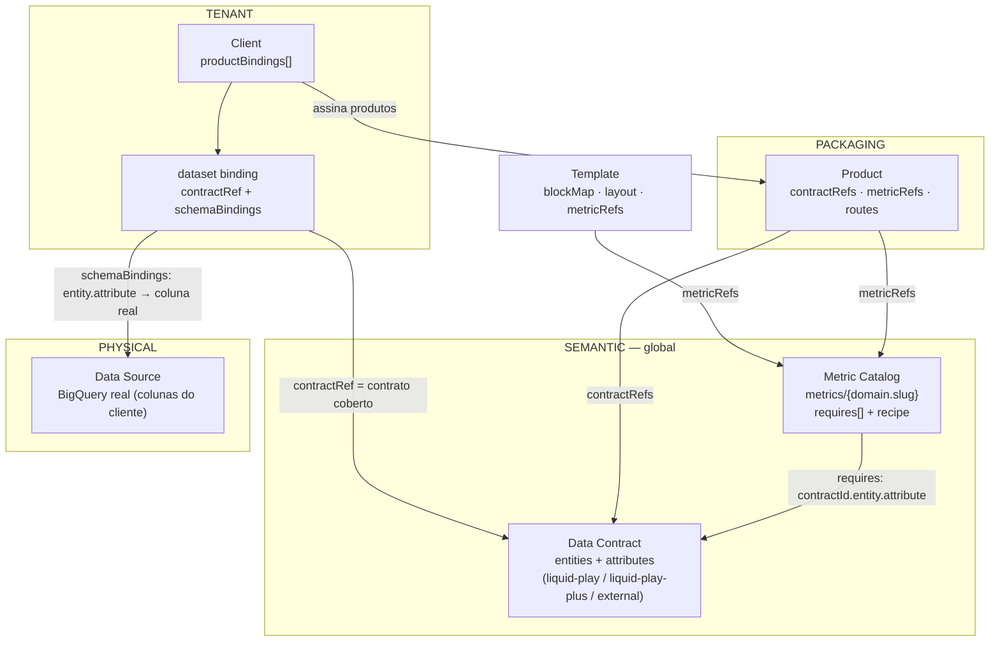
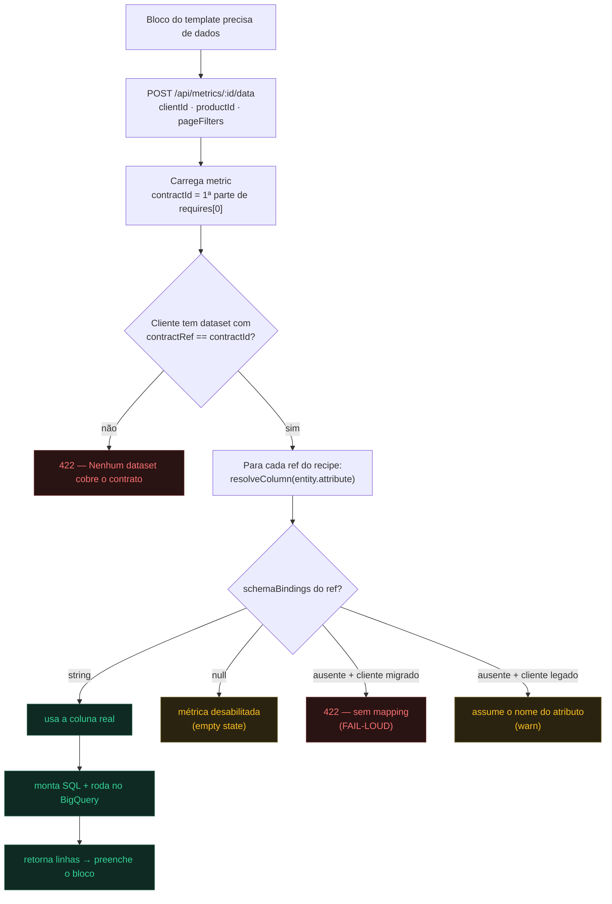
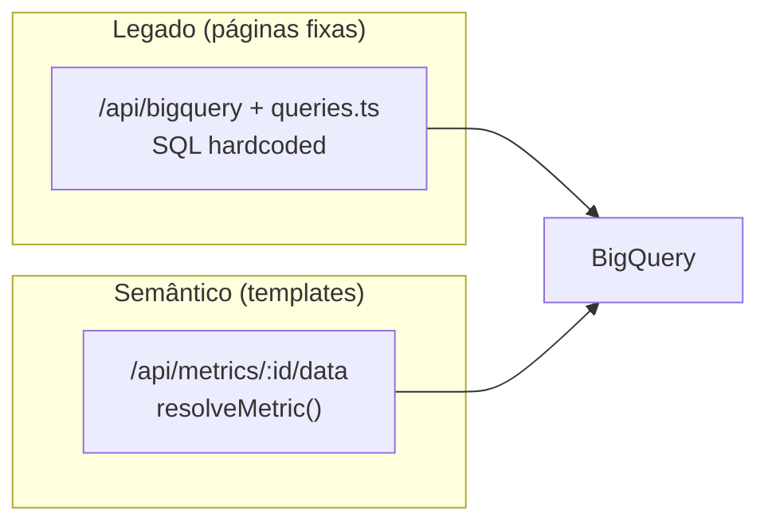

# Camada Semântica — Data Contract + Metric Catalog (ADR-0015)

Como o Liquid DataViz resolve dados: **Template → Métricas (contrato de KPI) → Data Contract (contrato de dados) → Client binding → BigQuery**.

> Fontes canônicas: `adrs/decisions/0015-semantic-layer-data-contract.md`, `src/shared/schemas/{metric,data-contract,client-binding}.ts`, `src/shared/lib/metrics/resolve-metric.ts`, `app/api/metrics/[id]/data/route.ts`.

Versão visual (HTML renderizado): `docs/arquitetura-camada-semantica.html`.

---

## Organograma de entidades (ER)

Entidades, campos e cardinalidades (1:N, N:N). Coleções Firestore: `dataContracts/{id}/entities/{e}/attributes/{a}`, `metrics/{id}`, `products/{id}`, `clients/{id}` (`productBindings → datasets`), `clients/{id}/groups/{g}/reports/{r}`.

## Mapa de camadas e fluxo

**Leitura:** o *Data Contract* é o vocabulário canônico (entidades + atributos). As *Métricas* declaram de que atributos precisam (`requires`) e como calcular (`recipe`). O *Product* só referencia contrato + métricas (não duplica schema). O *Client* assina produtos e, em cada `dataset binding`, diz **qual contrato cobre** (`contractRef`) e faz o de-para **atributo → coluna real** (`schemaBindings`). O *Template* é uma página que referencia métricas.

---

## Fluxograma — resolução de uma métrica

**Regra crítica (`resolveColumn`):** `string` → usa a coluna; `null` → métrica desabilita (empty state); **ausente + cliente "migrado"** (schemaBindings não-vazio) → **fail-loud** (não adivinha coluna); ausente + legado (schemaBindings vazio) → assume o nome do atributo (back-compat, com warn). A ADR-0015 (status `Proposed`) propunha "assume o nome" sempre; a implementação refinou para fail-loud em cliente migrado — proposital, para não rodar SQL contra colunas erradas em risco de crédito.

---

## Dois caminhos de dados

- **Legado** alimenta Visão Geral, Contratos, PDD… → por isso o **dashboard da BRZ funciona**.
- **Semântico** alimenta os blocos de **template importado** → é onde a **BRZ falha** (config semântica incompleta).

---

## Onde a BRZ está (diagnóstico)

| Item | Estado | Situação |
|---|---|---|
| `contractRef` dos datasets | era `canonical` (default do schema; contrato **inexistente** — os reais são `liquid-play`/`liquid-play-plus`) | ✅ corrigido → `liquid-play` |
| `schemaBindings` | mapeia só 2 atributos (`contratos.data_base_report`, `contratos.saldo_devedor`) | ❌ incompleto |
| schema semântico detectado | só 2 colunas, 1 entidade (`contratos`) | ❌ não sincronizado |
| métricas dos templates | exigem dezenas de atributos de `liquid-play` | ❌ não cobertos |

Como o `schemaBindings` não está vazio, a BRZ é tratada como **"migrada"** → todo atributo não mapeado dá fail-loud (ex.: `Attribute "contratos.rating_liquid" sem mapping`).

## Para a BRZ funcionar conforme a arquitetura

1. **Sincronizar o schema real** da BRZ (`/api/schema-detect` / `INFORMATION_SCHEMA`).
2. **Completar o `schemaBindings`** — mapear cada `entity.attribute` que as métricas usam → coluna real da BRZ (ou `null` para os ausentes, que desabilita a métrica com empty state).
3. **Conferir o `contractRef`** por binding (`liquid-play` e/ou `liquid-play-plus`).

Tooling: Admin → **Data Contracts** + **Schema Map** editor + detecção de schema. Mapeamento não deve ser adivinhado (é o que o fail-loud previne) — precisa casar atributos do contrato com as colunas reais da BRZ.
